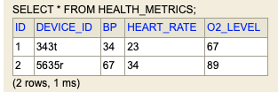
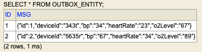

# Event Driven Architecture

#### Objective:
* This is an attempt to demonstrate a step by step approach to create an event driven architecture. 
* I have taken a very simple use case i.e. a patient health vitals collector, monitorning, alert and dashboarding.
* I have taken a incremental approach of adding new features/concepts in the app. Also, I am documenting each increment and things I have done in that increment. This will help you all to follow it step by step.
* Each increment I have marked with a unique git tag id. You can checkout each tag to see what has been done in that increment. I have also documented the steps and things I have done in that increment.
* You can see all the tags: https://github.com/akashdktyagi/event-driven-app-health-metrics/tags
* To checkout a specific tag you need to clone the project and then run: 
```git checkout -b newBranchName tagName```
* This will create a new branch with the changes of that branch. This apraoch is usefull only if you wish to follow the exact steps which I took. If not then follow the code in main. It is up to date with fully functional EDA app with the use case.


### Increment 1: MVP-1 : Init Steps
#### Change Log:
* Main Changes:
    * Basic Spring Boot app
    * Flyway library for DB evolution
    * Spring cloud API gateway
* Details
    * Created an spring boot api called as Health Metrics Collector API
        * A simple rest api
        * h2 DB used.
        * impl flyway migration scripts for evolving the db later.
        * When JPA and flyway both are being used make sure you disable the creation on table by jpa using:     hibernate: ddl-auto: none ; otherwise this could lead to clash.
        * Added a get and post endpoint to accept the patient vitals and save in h2 in-mem db
        * Added an api gateway component:
    * Used Spring cloud api gateway here.
        * Added the route config in the application yml.
        * These routes are configured to forward requests to our health metrics spring boot api.
  * Reference Links:
    * https://medium.com/@m1326318/configuring-spring-cloud-gateway-ced5dae663bb
    * https://spring.io/guides/gs/gateway/

### Increment: MVP-2 : Implemented EDA Outbox Pattern
#### Change Log:
* Main Changes:
    * Added Outbox Event Driven Architecture pattern (Not as fancy as it sounds. Check the link below from ref)
    * Not fully implemented i.e. data goes to two tables in the same tnx but publish to kafka topic does not happen yet in this change.
* Details:
    * Basically, created two tables/Entities in JPA and flyway.
    * Every time data comes to controller it now goes to two table. One health_metrics table and second outbox_message table.
    * Only thing to note is that both the table updates happen happen with in the same transaction. See the use of ```@Transaction``` annotation.
    * This means that either the data goes in both the tables or none at all.
    * I don't have to explain this here. Check the patterns details in below links.
* Reference Links:
    * https://microservices.io/patterns/data/transactional-outbox.html
    * https://medium.com/design-microservices-architecture-with-patterns/outbox-pattern-for-microservices-architectures-1b8648dfaa27
    * https://www.youtube.com/watch?v=u8fOnxAxKHk

* Images:
    * 
    * 